# Disaster Detection from Images using Machine Learning

## Project Overview
This project implements a **machine learning system for detecting natural disasters from images**, including:
- Fire damage
- Land disasters (e.g., landslides, earthquakes)
- Water disasters (e.g., floods)
- Non-damage / normal scenes

The goal is to **classify unseen images into predefined categories** using a convolutional neural network (CNN) and to provide a **demo REST API** through which users can upload images and receive predictions.

---

## Dataset
- **Dataset used:** Comprehensive Disaster Dataset (CDD) *(Disaster Images Dataset - Kaggle)
- **Classes:**
  - `Fire_Damage`
  - `Land_Disaster`
  - `Water_Disaster`
  - `Non_Damage`
- Images are resized to **224×224 RGB**
- Dataset split:
  - **80% training**
  - **20% validation**
- To reduce class imbalance, the majority classes (`Land_Disaster` and `Non_Damage`) were **downsampled in the training set**.

**Note:**  
The dataset is **not included** in this repository due to size constraints.  
The dataset is stored locally.

---

## Model
- **Architecture:** Custom Convolutional Neural Network (CNN)
- **Framework:** TensorFlow / Keras
- **Key components:**
  - Input normalization (`Rescaling`)
  - Convolution + MaxPooling layers
  - Global Average Pooling
  - Fully connected layers
- **Loss function:** Sparse Categorical Crossentropy (`from_logits=True`)
- **Optimizer:** Adam
- **Metric:** Accuracy
- **Regularization:** Dropout
- **Training strategy:** Early stopping based on validation loss

The model outputs **logits**, which are converted to probabilities using `softmax` during inference.

---

## Model Evaluation
Model performance is evaluated using:
- Validation accuracy
- Training vs validation accuracy plots

The trained models exceed 40% accuracy.

---

## Demo Application (API)
A **REST API** is implemented using **FastAPI**, allowing users to upload images and receive predictions from the trained model.

### Endpoints
- `POST /predict`  
  Accepts an image file and returns:
  - Predicted class
  - Confidence score
  - Top-K predictions

- `GET /models`  
  Returns the list of available models, their expected input sizes, and availability status.

---

## Model Selection
The API supports **multiple trained models**, allowing the user to choose which model to use at inference time.

Models may differ in:
- Input image resolution (e.g. 32×32, 224×224, 256×256)
- Training configuration (e.g. early stopping patience)

Models are registered internally and loaded on demand.

### Available models
Depending on locally available files, the following `model_name` values are supported:
- `default` – 224×224 model
- `32x32`
- `64x64`
- `128x128`
- `224x224`
- `256x256`
- `patience4` – model trained with increased early stopping patience

If no model is specified, the API uses the `default` model.

---

## Running the API
Start the API using Uvicorn 
```
python -m uvicorn ai_service:app --reload
```

## Example request using curl:

```
curl -X POST "http://localhost:8000/predict?model_name=224x224&top_k=3" \
  -F "file=@/path/fire_local.jpg"
```

## Example response:

```
{"filename":"fire_local.jpg","model_name":"224x224",
"image_size":{"width":224,"height":224},"prediction":
{"label":"Fire_Damage","confidence":0.9996077418327332},
"top_k":
[{"label":"Fire_Damage","confidence":0.9996077418327332},
{"label":"Land_Disaster","confidence":0.0002721925266087055},
{"label":"Non_Damage","confidence":0.00011991128121735528}]}
```

## Model Training Performance

The training behavior of all trained models was analyzed using **training and validation accuracy
over epochs**. This allows comparison of convergence speed, stability, and the effect of input
resolution and training configuration on model performance.

For each model, two plots are provided:
- **Training performance plot** (training vs validation accuracy)
- **Epoch progression plot**, indicating how many epochs were required until convergence or early stopping

---

### Model: 32×32
This model converges very quickly due to the low input resolution, but with limited representational capacity.

**Training performance**
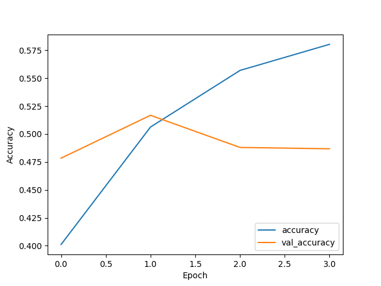

**Epochs**
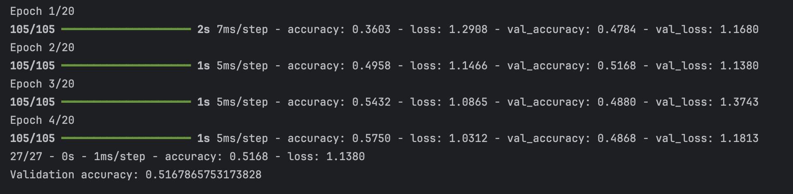

---

### Model: 64×64 (Batch size = 64)
Increasing the input resolution improves feature representation while maintaining relatively fast convergence.

**Training performance**
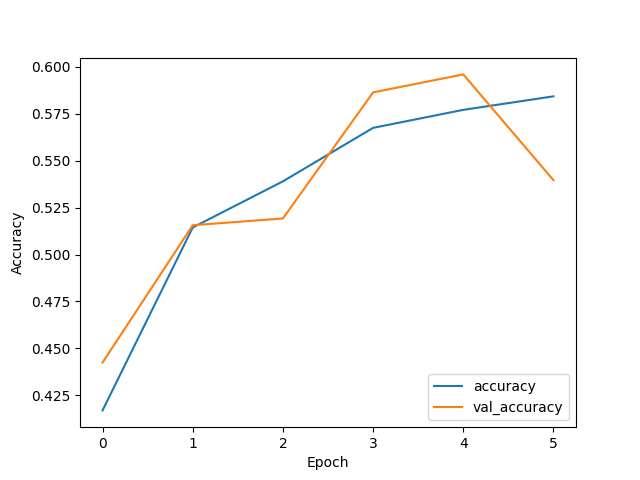

**Epochs**
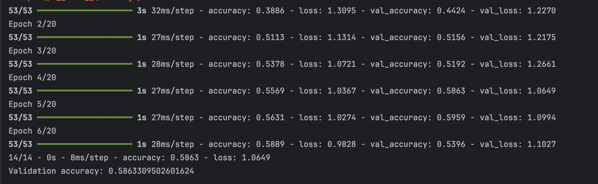

---

### Model: 128×128
This model provides a balance between input detail and training efficiency, with improved validation stability.

**Training performance**


**Epochs**
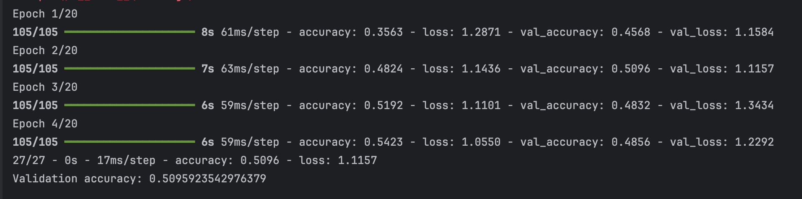

---

### Model: 224×224 (Default)
The default model uses higher-resolution inputs, enabling more detailed feature extraction at the cost of longer training time.

**Training performance**
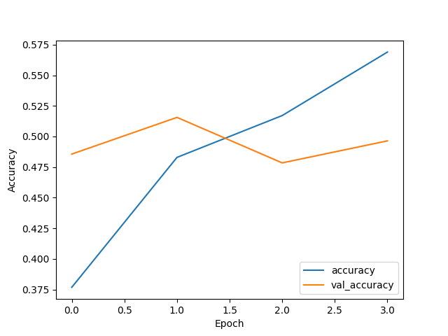

**Epochs**
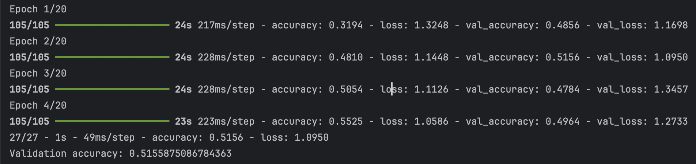

---

### Model: 224×224 (Early Stopping Patience = 4)
Increasing the early stopping patience allows the model additional epochs to converge, resulting in a more gradual and stable learning process.

**Training performance**
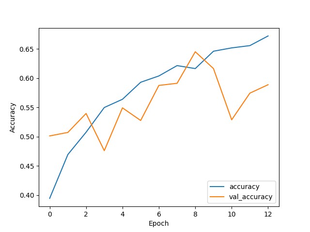

**Epochs**
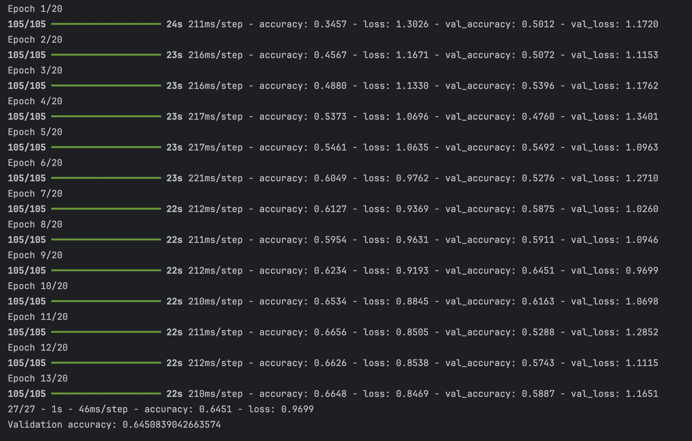

---

### Model: 256×256
The highest-resolution model captures the most spatial detail but requires the longest training time and increased computational resources.

**Training performance**
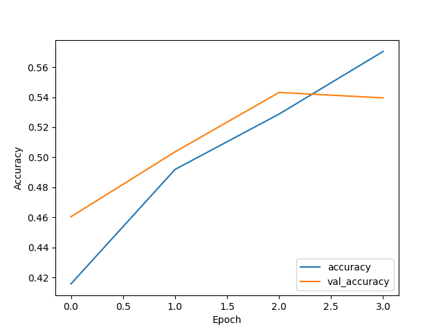

**Epochs**
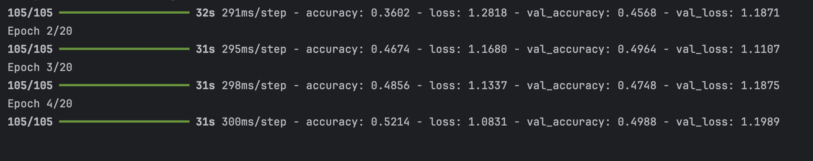

---

### Summary
Lower-resolution models converge faster but generally achieve lower validation accuracy.
Higher-resolution models improve classification performance at the cost of increased training time.
Adjusting early stopping parameters (e.g., patience) can further influence convergence stability.

These results highlight the trade-offs between **input resolution, training efficiency, and model performance**.

